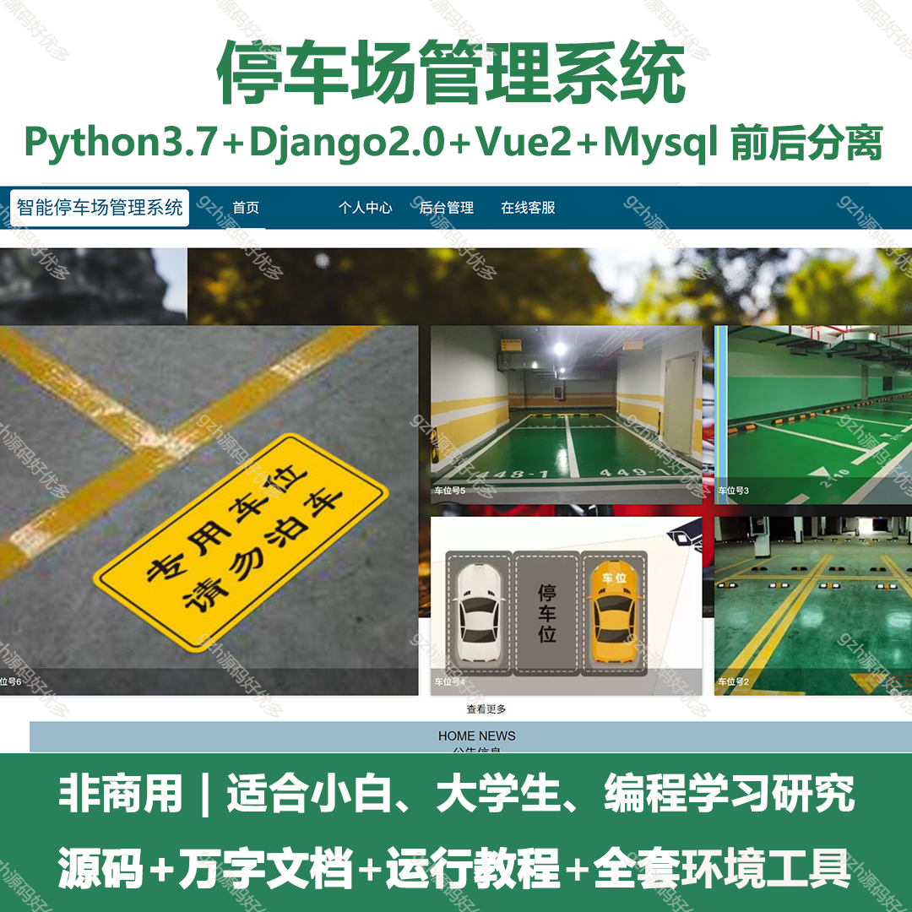
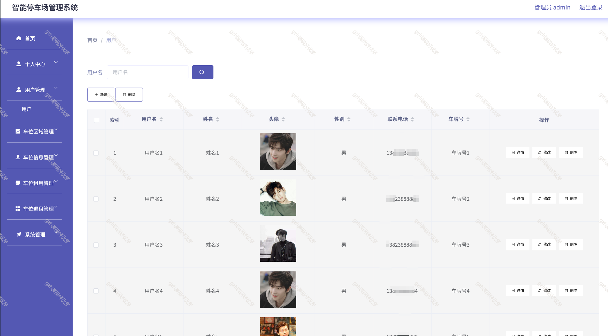
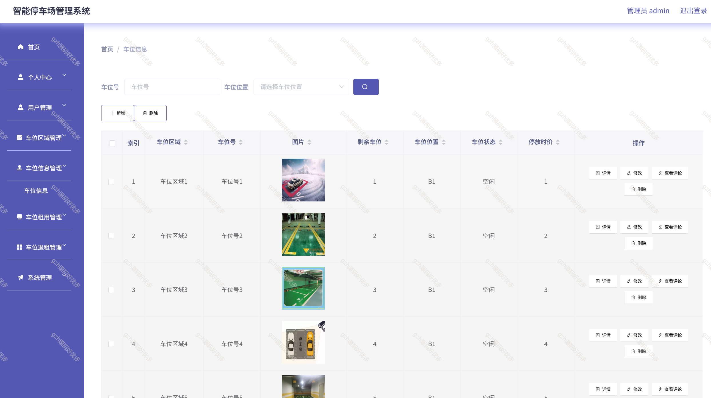
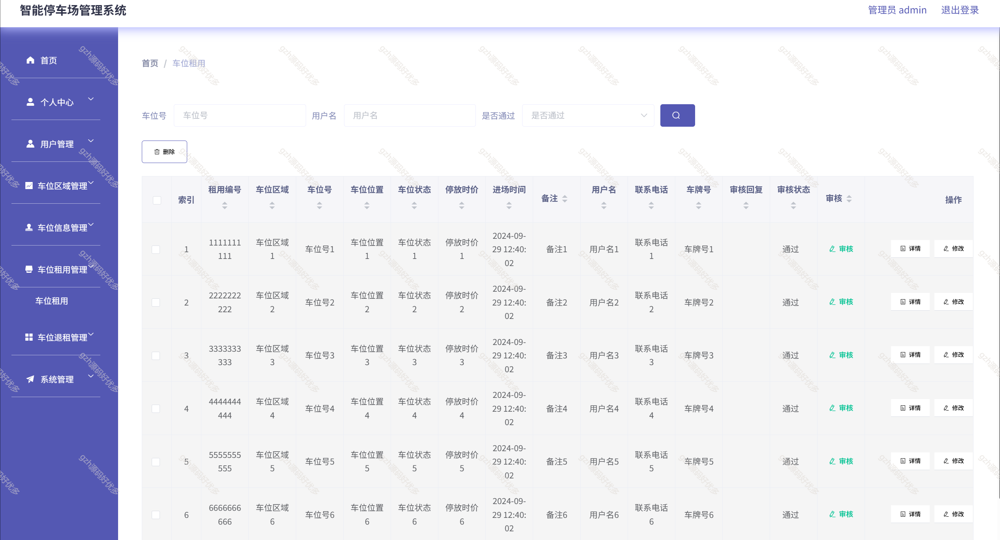
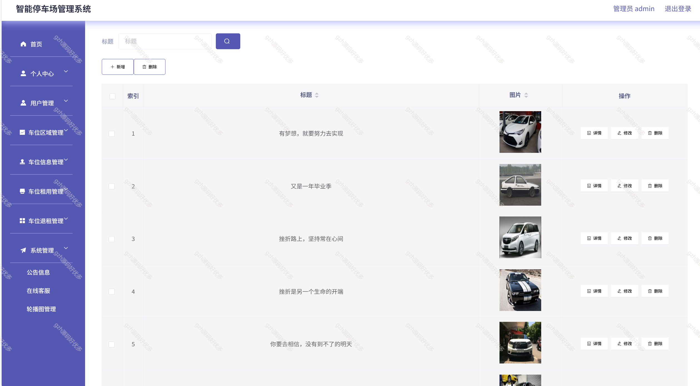
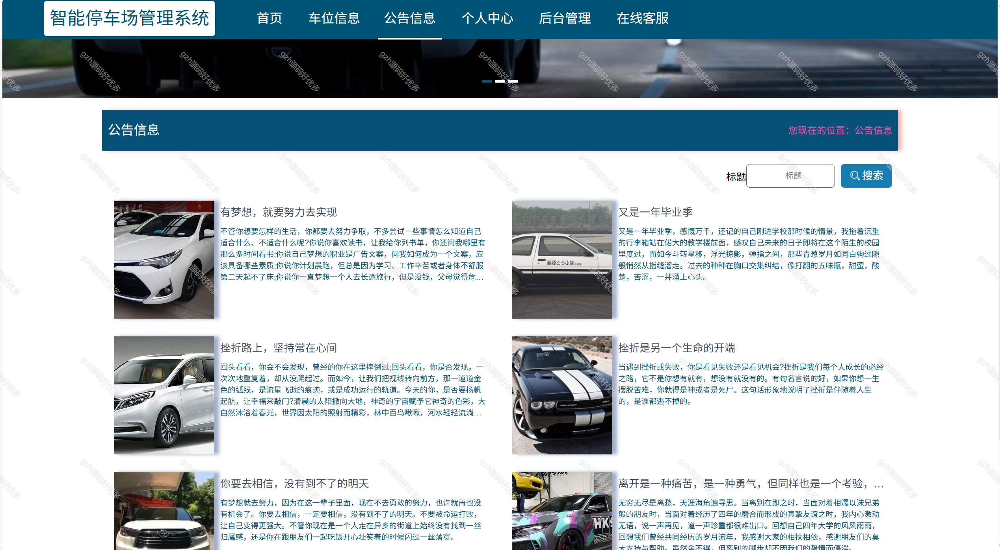
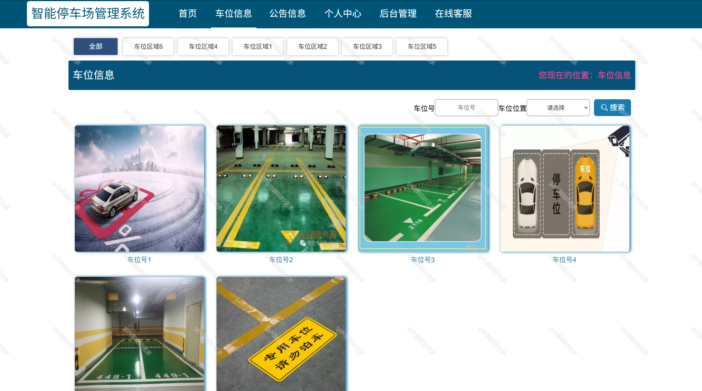
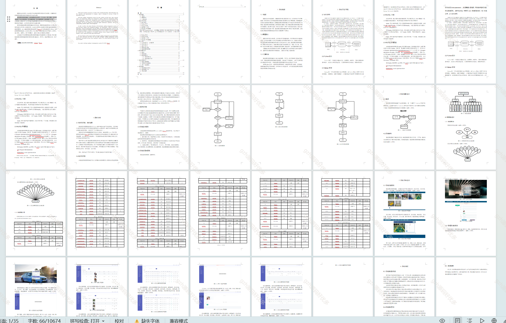

# python049
python049基于Python+Django的停车场管理系统
 
## 查看主页获取源码

### 一、关键词
停车场系统，智能停车场系统

### 二、作品包含
源码+数据库+设计文档万字+全套环境和工具资源+部署教程

### 三、项目技术
前端技术：Vue2.0、Element-ui、Layui
后端技术：Python3.7、Django2.0

### 四、运行环境（以下版本亲测，其他版本兼容性请自行测试）
开发工具：PyCharm + VSCODE

数据库：MySQL5.7（最低要5.7版本）

数据库管理工具：Navicat10+

Python：Python3.7

前端Nodejs：14

浏览器：谷歌浏览器

### 五、项目介绍
项目编号：python049

随着社会的发展，社会的各行各业都在利用信息化时代的优势。计算机的优势和普及使得各种信息系统的开发成为必需

智能停车场管理系统，主要的模块包括首页、个人中心、用户管理、车位区域管理、车位信息管理、车位租用管理、车位退租管理、系统管理等功能。

### 六、运行截图

